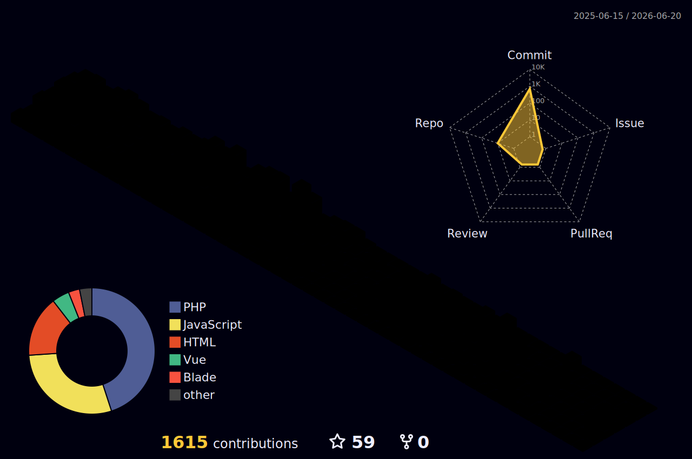

  <i>"If I have something to do today, I will do it now. To do something else tomorrow."</i>

<h3 align="center">
  
</h3>

  I'm a BSIT student at <strong>Central Luzon State University</strong> and an aspiring full-stack developer. 
  I build web tools, mini-games, academic systems, and UI experiments — mostly with Vue, Laravel, and Tailwind.

---

### 🌐 Connect with Me

  
  
  
  
  
  
  

 

---

## 🚀 What I'm Currently Working On

- 🧩 **ToolGrid** — A growing collection of browser-based developer tools (Vue 3 + Tailwind)
- 🎮 **GameZone** — Interactive mini-games with responsive layouts and modals (Vue 3)
- 🎨 **StyleGen** — Visual CSS generators for borders, gradients, shadows, and more (Vue 3)
- 📋 **CSMS** — Course Syllabus Management System for CLSU (Laravel + Livewire)

---

## 🧱 What I Build

| Type | Examples |
|---|---|
| 🧩 Web tools & generators | ToolGrid, StyleGen |
| 🎮 Mini-games & interactive UI | GameZone |
| 📊 CRUD & academic systems | CSMS, TRGC Attendance |
| 🌐 Informational websites | TRGC Church Website |
| 🎨 UI/UX experiments | Frontend clones, landing pages |

---

## 🗂️ Featured Projects

<table>
  <tr>
    <td width="50%">
      <h3>🧩 ToolGrid</h3>
      
26+ browser-based developer tools — text analyzers, converters, generators, and more. No installs, no sign-ups.

      

        
        
        
      

    </td>
    <td width="50%">
      <h3>🎮 GameZone</h3>
      
8 interactive browser games — Tic Tac Toe, Connect Four, Word Scramble, Emoji Catcher, and more.

      

        
        
        
      

    </td>
  </tr>
  <tr>
    <td width="50%">
      <h3>🎨 StyleGen</h3>
      
Visual CSS generators for borders, gradients, shadows, filters, border-radius, transforms, and more.

      

        
        
        
      

    </td>
    <td width="50%">
      <h3>📋 CSMS</h3>
      
Course Syllabus Management System for CLSU — role-based access, OTP verification, syllabus wizard, and audit logs.

      

        
        
        
      

    </td>
  </tr>
  <tr>
    <td width="50%">
      <h3>⛪ TRGC Website</h3>
      
Informational website for The Risen Generation Church — leadership, ministries, programs, and giving info.

      

        
        
        
      

    </td>
    <td width="50%">
      <h3>📅 TRGC Attendance</h3>
      
Church attendance tracking system built with Laravel — member management, session records, and reports.

      

        
        
      

    </td>
  </tr>
</table>

---

## 💻 Tech Stack

### 🧠 Languages

### 🌐 Frontend

### 🔧 Backend & Database

### 🧰 Tools & Design

### 🎮 Gaming (Just for Fun)

---

## 📈 GitHub Stats

  
  

---

## 🐍 Contribution Snake

<picture>
  <source media="(prefers-color-scheme: dark)" srcset="https://raw.githubusercontent.com/Je-ric/Je-ric/output/github-snake-dark.svg" />
  <source media="(prefers-color-scheme: light)" srcset="https://raw.githubusercontent.com/Je-ric/Je-ric/output/github-snake.svg" />
  
</picture>

